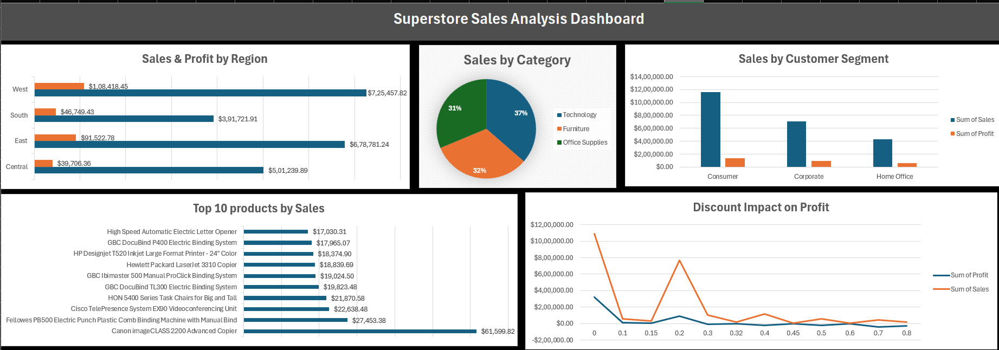

# Superstore Sales Analysis | Microsoft Excel

## Overview
I analyzed a Superstore sales dataset using Microsoft Excel to explore
sales performance, profitability, and customer trends. The project
involved data quality checks, 10 Pivot Table analyses, formula
demonstrations using VLOOKUP, SUMIF and XLOOKUP, and a 5-chart
dashboard built from Pivot Tables.

## Tools
- Microsoft Excel (Pivot Tables, Charts, VLOOKUP, SUMIF, XLOOKUP)

## Dataset
- Source: Kaggle
- 9,995 rows of transactional sales data
- Fields: Orders, Customers, Products, Sales, Profit, Discount, Region

## What I Analyzed
1. Sales and Profit by Region
2. Top 10 Products by Sales
3. Sales and Profit by Category
4. Sales by Customer Segment
5. Top 10 Customers by Sales
6. Sales by Ship Mode
7. Average Discount by Sub-Category
8. Top 10 States by Sales
9. Profit by Region and Category
10. Discount Impact on Profit

## Formulas Demonstrated
- VLOOKUP — single record lookup by customer name
- SUMIF — total sales aggregation by customer
- XLOOKUP — product category and sub-category lookup

## Dashboard

## Key Insights
- West region leads in both sales and profit
- Technology is the most profitable category
- Furniture is nearly unprofitable despite high sales
- Discounts above 20% consistently result in losses
- Canon imageCLASS 2200 is the top selling product
- Consumer segment drives the majority of revenue
